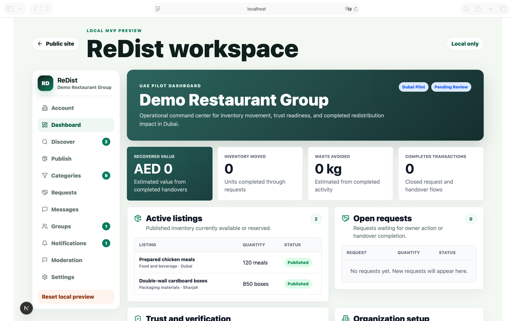
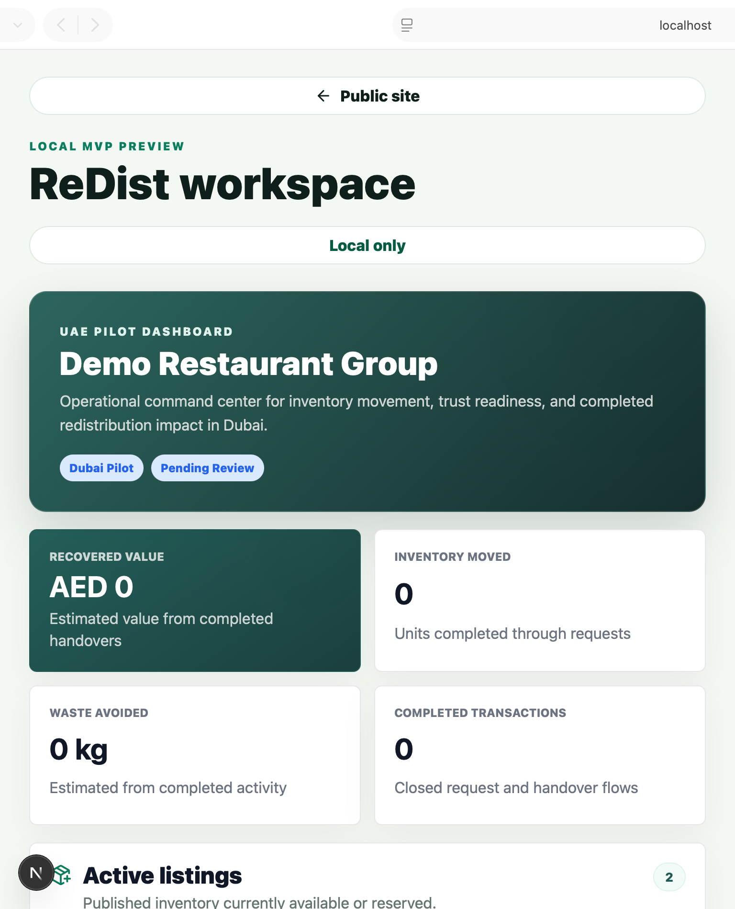
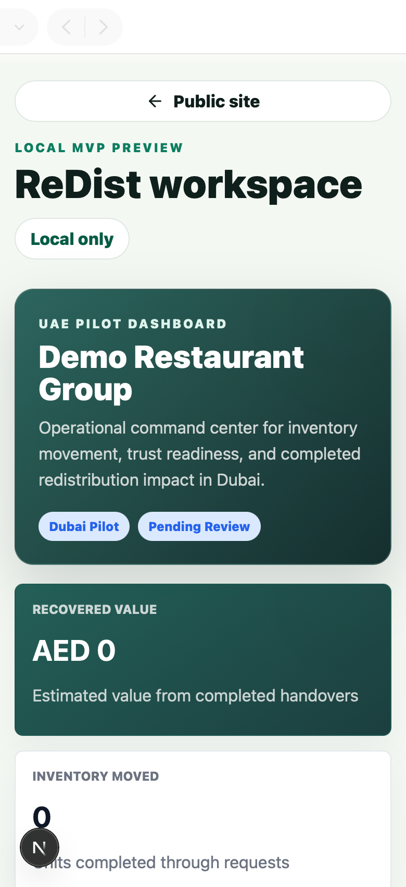

# Dashboard UI Transformation Report

## Scope

UI Transformation Phase 1 transformed the existing ReDist workspace dashboard section to follow the approved Metronic dashboard direction while preserving the current local MVP functionality.

Inputs used:

- `docs/REDIST_DESIGN_SYSTEM.md`
- `docs/METRONIC_PAGE_MAPPING.md`
- `docs/METRONIC_UI_TRANSFORMATION_PLAN.md`

## Before Summary

The previous dashboard was a compact MVP control-center view with:

- A large local preview hero.
- Four generic summary metric cards.
- Organization setup form.
- Basic impact preview.
- Audit trail preview.

Limitations:

- Dashboard hierarchy was broad and prototype-oriented.
- It did not expose active listings, open requests, completed transactions, trust score, verification status, recent activity, and notifications together.
- Mobile layout inherited the workspace shell issue where navigation appeared before selected dashboard content.
- Dashboard cards used the existing visual style but were not aligned to the enterprise SaaS dashboard structure defined in the approved Metronic mapping.

## After Summary

The transformed dashboard now uses an enterprise dashboard structure:

- UAE pilot dashboard header.
- Impact summary cards.
- Active listings table.
- Open requests table.
- Completed transactions KPI.
- Trust score placeholder.
- Verification status placeholder.
- Organization setup panel.
- Recent activity feed.
- Notifications preview.

The visual direction now better matches the ReDist design system:

- Neutral enterprise card surfaces.
- Brand green reserved for trust, verification, and impact emphasis.
- Subtle borders and 8 px card radius for dashboard cards.
- Clear KPI hierarchy.
- Status pills for verification and listing/request states.
- Responsive table-to-card behavior on mobile.
- Dark mode variables through `prefers-color-scheme`.
- `dir="auto"` on the dashboard shell for RTL-readiness.

## Functionality Preservation

Existing local workspace behavior was preserved:

- Dashboard still reads existing local state.
- Organization setup form still calls the existing `updateOrganization` handler.
- Existing listings, requests, notifications, audit events, account verification state, saved count, and reports are reused.
- No API, database, or workflow changes were introduced.

## Files Changed

- `apps/web/src/app/app/workspace.tsx`
- `apps/web/src/app/globals.css`
- `docs/DASHBOARD_UI_TRANSFORMATION_REPORT.md`
- `docs/screenshots/dashboard-desktop.png`
- `docs/screenshots/dashboard-tablet.png`
- `docs/screenshots/dashboard-mobile.png`

## Validation

### Desktop

Status: Pass

Notes:

- Dashboard uses a Metronic-style two-column operational layout.
- KPI cards, active listings, open requests, trust/verification, organization setup, activity, and notifications are visible in a clear hierarchy.
- No horizontal overflow observed in the captured desktop view.

Screenshot:



### Tablet

Status: Pass

Notes:

- Dashboard content appears before workspace navigation after responsive shell adjustment.
- KPI cards collapse into a two-column layout.
- Main dashboard panels remain readable.

Screenshot:



### Mobile

Status: Pass with follow-up

Notes:

- Dashboard content now appears before workspace navigation on small screens.
- KPI cards stack into a single column.
- Text remains readable and primary dashboard hierarchy is visible.
- Follow-up: the existing Next.js development indicator can overlap the lower-left viewport during local development screenshots. This is not part of the production UI.

Screenshot:



## Technical Validation

Commands run:

```bash
./.tools/pnpm --filter @redist/web typecheck
./.tools/pnpm --filter @redist/web build
```

Results:

- Typecheck passed.
- Production build passed.

## Implementation Notes

- No Metronic template files are currently present in the repository, so the implementation follows the approved Metronic dashboard structure rather than importing template code.
- Dark mode support was added through CSS custom properties and `prefers-color-scheme`.
- RTL readiness was improved through dashboard-level `dir="auto"` and layout choices that avoid hard-coded directional assumptions in the new dashboard components.
- The dashboard remains inside the current `/app` local workspace route; route-level dashboard extraction is still a later transformation phase.

## Follow-Up Recommendations

1. Extract dashboard cards, KPI cards, status pills, and dashboard tables into reusable UI components.
2. Add a production route for `/app/dashboard` once route-level workspace transformation begins.
3. Replace local preview data with API-backed dashboard queries.
4. Add formal visual regression screenshots through Playwright or another CI-safe screenshot runner.
5. Hide or disable local development overlays in screenshot workflows.
