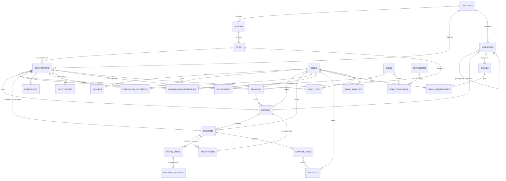

# ReDist Entity Relationship Diagram

## Purpose

This document defines the target production entity model for ReDist. It includes current implementation entities and target entities required for a production multi-tenant circular inventory platform.

Some entities in this diagram already exist in the current Supabase migrations. Others are target production entities that should be introduced through future database design work.

## Entity Status

| Entity | Current status |
| --- | --- |
| Users | Exists through `auth.users`; profile exists as `profiles` |
| Organizations | Exists |
| Organization membership | Exists as `organization_members` |
| Categories | Exists |
| Listings | Exists |
| Requests | Exists as `listing_requests` |
| Verification documents | Exists as `organization_verification_documents` |
| Certificates/licenses | Exists partially as `organization_licenses` |
| Notifications | Exists |
| Messages | Exists |
| Groups | Exists |
| Saved searches | Exists |
| Audit logs | Exists as `audit_events` |
| Countries | Target production entity |
| Regions | Target production entity |
| Cities | Target production entity |
| Branches | Target production entity |
| Roles | Target production entity; current enum is limited |
| Permissions | Target production entity |
| Reservations | Target production entity; currently implicit in accepted requests and quantity updates |
| Transactions | Target production entity |
| Handover records | Target production entity |
| Trust scores | Target production entity |

## High-Level ERD

## Core Entity Definitions

### Countries

Represents a country where ReDist operates or plans to operate.

Key fields:

- `id`
- `iso_code`
- `name`
- `default_currency`
- `default_language`
- `is_active`
- `launch_status`

Relationships:

- Country has many regions.
- Country has many organizations.
- Country configures category availability and verification rules.

### Regions

Represents a state, emirate, province, or equivalent administrative region.

Key fields:

- `id`
- `country_id`
- `name`
- `code`
- `is_active`

Relationships:

- Region belongs to a country.
- Region has many cities.

### Cities

Represents a city or locality used for discovery, branches, and handovers.

Key fields:

- `id`
- `country_id`
- `region_id`
- `name`
- `is_active`

Relationships:

- City belongs to a country and region.
- City has many organizations and branches.
- City is used in listing discovery filters.

### Organizations

Represents a verified or pending business, NGO, school, supplier, manufacturer, or institution.

Key fields:

- `id`
- `country_id`
- `city_id`
- `name`
- `slug`
- `legal_name`
- `trade_name`
- `account_type`
- `business_category`
- `verification_status`
- `created_by`

Relationships:

- Organization belongs to a country and city.
- Organization has many branches.
- Organization has many memberships.
- Organization owns listings.
- Organization submits verification documents and certificates.
- Organization has trust scores.

### Branches

Represents a physical operating, storage, or handover location for an organization.

Key fields:

- `id`
- `organization_id`
- `country_id`
- `region_id`
- `city_id`
- `name`
- `address`
- `contact_name`
- `contact_phone`
- `is_active`

Relationships:

- Branch belongs to an organization.
- Branch belongs to a country, region, and city.
- Branch has many listings and handover records.

### Users

Represents authenticated people using ReDist.

Current implementation:

- Supabase `auth.users`.
- Public profile data in `profiles`.

Key profile fields:

- `id`
- `display_name`
- `phone`
- `country_code`
- `city`

Relationships:

- User has one profile.
- User can belong to many organizations.
- User can create listings and requests.
- User can send messages.
- User can receive notifications.
- User can act in audit logs.

### Roles

Represents named access roles.

Recommended roles:

- Owner admin.
- Inventory manager.
- Requester.
- Viewer.
- Verifier.
- Moderator.
- Support operator.
- Country admin.
- Platform admin.

Relationships:

- Role has many permissions.
- Role is assigned through organization membership or platform staff assignment.

### Permissions

Represents granular access capabilities.

Example permissions:

- `organization.update`
- `branch.manage`
- `listing.create`
- `listing.publish`
- `request.create`
- `request.accept`
- `handover.complete`
- `verification.submit`
- `verification.review`
- `moderation.review`
- `category.manage`
- `audit.view`
- `analytics.view`

Relationships:

- Permission belongs to many roles through role permissions.

### Listings

Represents inventory made available for redistribution, sale, or exchange.

Key fields:

- `id`
- `organization_id`
- `branch_id`
- `category_id`
- `created_by`
- `title`
- `description`
- `reason`
- `offer_type`
- `quantity_total`
- `quantity_available`
- `unit`
- `unit_price`
- `currency`
- `expiry_date`
- `status`

Relationships:

- Listing belongs to organization.
- Listing can belong to branch.
- Listing belongs to category.
- Listing has many requests.
- Listing has many reservations.
- Listing can have images and audit logs.

### Categories

Represents approved inventory categories and subcategories.

Key fields:

- `id`
- `country_id`
- `parent_id`
- `name`
- `slug`
- `is_restricted`
- `is_active`
- `requires_verification`
- `sort_order`

Relationships:

- Category can belong to a country.
- Category can have parent and child categories.
- Category has many listings.
- Category can organize groups.

### Requests

Represents an organization's request for listing quantity.

Key fields:

- `id`
- `listing_id`
- `requester_organization_id`
- `requester_user_id`
- `requested_quantity`
- `message`
- `status`
- `accepted_at`
- `completed_at`

Relationships:

- Request belongs to listing.
- Request belongs to requester organization.
- Request has reservations.
- Request can produce transactions.
- Request opens a conversation.

### Reservations

Represents reserved listing quantity after owner acceptance.

Key fields:

- `id`
- `listing_id`
- `request_id`
- `reserved_quantity`
- `status`
- `reserved_at`
- `released_at`

Relationships:

- Reservation belongs to listing.
- Reservation belongs to request.
- Reservation can be completed, cancelled, or released.

Production note:

- The current implementation reserves quantity by updating `listings.quantity_available` when a request is accepted. A dedicated reservation entity improves traceability and partial handover support.

### Transactions

Represents the commercial or non-commercial transfer record created from an accepted request.

Key fields:

- `id`
- `request_id`
- `owner_organization_id`
- `requester_organization_id`
- `offer_type`
- `quantity`
- `unit`
- `unit_price`
- `currency`
- `total_value`
- `status`

Relationships:

- Transaction belongs to request.
- Transaction has handover records.
- Transaction contributes to impact reporting.

Production note:

- Payments are deferred. Transactions should initially record value and fulfillment, not process money.

### Handover Records

Represents the operational handover of inventory.

Key fields:

- `id`
- `transaction_id`
- `request_id`
- `branch_id`
- `handover_method`
- `scheduled_at`
- `completed_at`
- `owner_confirmed_by`
- `requester_confirmed_by`
- `status`
- `notes`

Relationships:

- Handover record belongs to transaction and request.
- Handover record can reference branch.
- Handover record can have evidence files.

### Certificates

Represents organization licenses, permits, and certificates.

Current implementation:

- `organization_licenses`.

Key fields:

- `id`
- `organization_id`
- `certificate_type`
- `certificate_number`
- `issuing_authority`
- `issue_date`
- `expiry_date`
- `document_path`
- `status`
- `reviewed_by`

Relationships:

- Certificate belongs to organization.
- Certificate can unlock category access.
- Certificate is reviewed by authorized users.

### Verification Documents

Represents uploaded verification documents for organization review.

Current implementation:

- `organization_verification_documents`.

Key fields:

- `id`
- `organization_id`
- `document_type`
- `document_path`
- `status`
- `review_notes`
- `created_by`
- `reviewed_by`

Relationships:

- Verification document belongs to organization.
- Verification document is created by organization admin.
- Verification document is reviewed by verifier or platform admin.

### Trust Scores

Represents calculated trust indicators for an organization.

Key fields:

- `id`
- `organization_id`
- `score`
- `completion_rate`
- `cancellation_rate`
- `dispute_rate`
- `average_response_time`
- `verified_documents_count`
- `calculated_at`

Relationships:

- Trust score belongs to organization.
- Trust score derives from requests, handovers, moderation, and verification data.

### Notifications

Represents in-app, email, or future push notification records.

Key fields:

- `id`
- `user_id`
- `organization_id`
- `type`
- `title`
- `body`
- `entity_type`
- `entity_id`
- `read_at`
- `created_at`

Relationships:

- Notification belongs to user.
- Notification can be scoped to organization.
- Notification can link to listing, request, verification, handover, or moderation records.

### Messages

Represents request-linked conversation messages.

Current related entities:

- `conversations`.
- `messages`.

Key fields:

- `id`
- `conversation_id`
- `sender_id`
- `body`
- `created_at`

Relationships:

- Request has one conversation.
- Conversation has many messages.
- Message belongs to sender.

### Groups

Represents category or location-based groups followed by users.

Current related entities:

- `groups`.
- `group_members`.

Key fields:

- `id`
- `category_id`
- `country_id`
- `city_id`
- `name`
- `slug`
- `description`
- `created_by`

Relationships:

- Group can belong to category and geography.
- Group has many user memberships.
- Group can support discovery and notification targeting.

### Saved Searches

Represents a user's reusable listing filter.

Key fields:

- `id`
- `user_id`
- `name`
- `filters`
- `notify`
- `created_at`

Relationships:

- Saved search belongs to user.
- Saved search can generate notification matches.

### Audit Logs

Represents immutable event records for sensitive actions.

Current implementation:

- `audit_events`.

Key fields:

- `id`
- `actor_id`
- `organization_id`
- `event_type`
- `entity_type`
- `entity_id`
- `details`
- `created_at`

Relationships:

- Audit log belongs to actor.
- Audit log can be scoped to organization.
- Audit log references workflow, verification, moderation, and admin entities.

## Detailed Relationship Notes

### Geography and Tenancy

- A country has many regions and cities.
- An organization is registered in one primary country.
- An organization can operate multiple branches.
- A branch belongs to a city and acts as the default handover point for listings.

### Users and Access

- Users do not directly own organization data.
- Users gain access through organization memberships.
- Memberships assign roles.
- Roles grant permissions.
- Platform roles may require a separate staff assignment model if they are not organization-scoped.

### Inventory Workflow

- Organizations create listings through authorized users.
- Listings receive requests from other organizations.
- Accepted requests create reservations.
- Reservations protect inventory quantity.
- Transactions represent the agreed transfer.
- Handover records track physical completion.
- Completed handovers feed impact and trust score calculations.

### Compliance and Trust

- Organizations submit certificates and verification documents.
- Verification state controls access to restricted categories.
- Trust scores derive from completed handovers, cancellations, disputes, response times, and verification quality.
- Audit logs preserve sensitive changes.

### Communication

- Requests create conversations.
- Conversations contain messages.
- Notifications link users back to listings, requests, verification records, handovers, groups, or admin tasks.
- Saved searches can produce notification events.

## Production Modeling Recommendations

- Replace free-text country and city fields with foreign keys to countries, regions, and cities.
- Add branches before scaling multi-location organizations.
- Expand roles from enum-only membership to role and permission tables.
- Add reservations as a first-class entity before complex partial handovers.
- Add handover records before impact reporting becomes customer-facing.
- Keep transactions value-tracking only until payments and compliance are approved.
- Add trust scores only after enough verified transaction history exists.
- Keep polymorphic audit and notification links, but add consistent entity typing, indexes, and scoped access policies.
