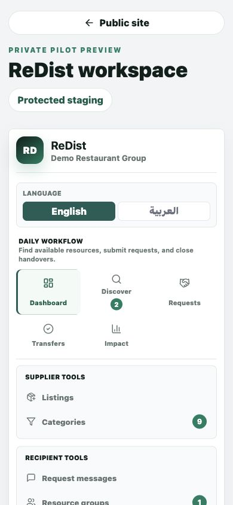
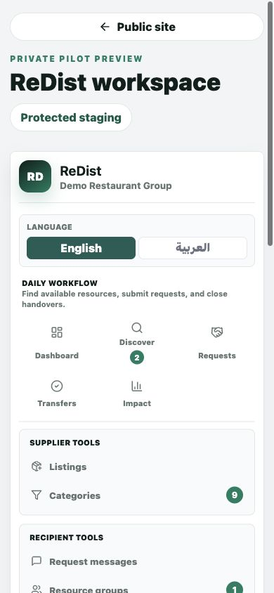
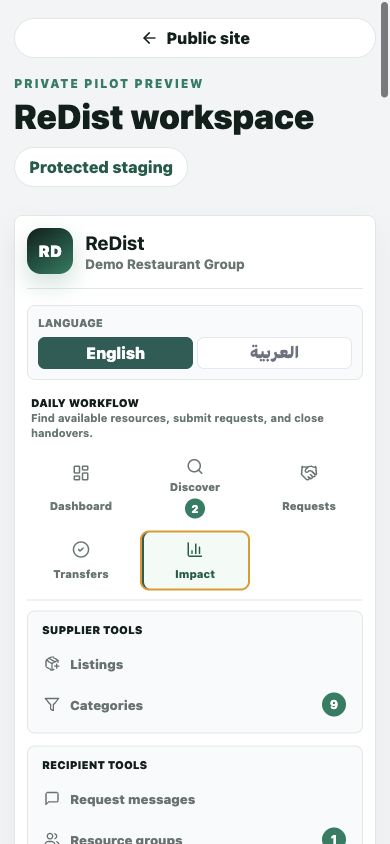

# ReDist Administrator Guide

Version: 2026-06-22  
Audience: Founder, platform administrators, reviewers, and pilot operators  
Status: Bilingual guide for founder-guided pilot operations

## 1. Admin Purpose

### English

Administrators use ReDist to monitor verification, documents, requests, transfers, certificates, impact evidence, lead review, and pilot readiness. Admin work should support trust and operational safety without adding unnecessary workflow friction.

### العربية

يستخدم المشرفون ReDist لمراقبة التحقق والمستندات والطلبات والتحويلات والشهادات وإثبات الأثر ومراجعة العملاء المحتملين وجاهزية التجربة. يجب أن يدعم العمل الإداري الثقة والسلامة التشغيلية دون إضافة تعقيد غير ضروري.

## 2. Daily Admin Review

### English

1. Open the Dashboard.
2. Review **Needs Attention**.
3. Check requests awaiting response, transfers awaiting verification, urgent listings, and admin review items.
4. Resolve safety or trust concerns before reviewing analytics.
5. Escalate any unclear legal, safety, or category issue to founder review.

### العربية

1. افتح لوحة التحكم.
2. راجع **ما يحتاج إلى انتباه**.
3. تحقق من الطلبات بانتظار الرد والتحويلات بانتظار التحقق والعروض العاجلة وعناصر المراجعة الإدارية.
4. عالج مخاوف السلامة أو الثقة قبل مراجعة التحليلات.
5. صعد أي مسألة قانونية أو سلامة أو فئة غير واضحة إلى مراجعة المؤسس.

## 3. Verification And Documents

### English

1. Review organization identity and document status.
2. Check trade license, VAT/TRN, permits, authorization records, and expiry dates where available.
3. Mark records according to actual review status.
4. Do not approve restricted categories without proper policy and legal review.
5. Keep verification language clear: reviewed information is not a guarantee of future conduct.

### العربية

1. راجع هوية المؤسسة وحالة المستندات.
2. تحقق من الرخصة التجارية و VAT/TRN والتصاريح وسجلات التفويض وتواريخ الانتهاء عند توفرها.
3. صنف السجلات حسب حالة المراجعة الفعلية.
4. لا تعتمد الفئات المقيدة دون سياسة مناسبة ومراجعة قانونية.
5. اجعل لغة التحقق واضحة: المعلومات التي تمت مراجعتها ليست ضمانا للسلوك المستقبلي.

## 4. Request And Transfer Oversight

### English

1. Review requests that are stalled, unclear, rejected, or disputed.
2. Confirm the next required action is visible to the responsible party.
3. Use Transfers to check handover readiness and verification status.
4. Watch for cancelled, expired, declined, or blocked handovers.
5. Preserve audit context for disputes or certificate corrections.

### العربية

1. راجع الطلبات المتوقفة أو غير الواضحة أو المرفوضة أو المتنازع عليها.
2. تأكد من ظهور الإجراء التالي للطرف المسؤول.
3. استخدم التحويلات للتحقق من جاهزية التسليم وحالة التحقق.
4. راقب التسليمات الملغاة أو المنتهية أو المرفوضة أو المتوقفة.
5. احتفظ بسياق التدقيق للنزاعات أو تصحيحات الشهادات.

## 5. Certificates And Impact Evidence

### English

1. Review completed transfers before relying on certificates.
2. Confirm public certificate evidence exposes only public-safe details.
3. Treat certificate records as operational evidence, not legal documents.
4. Review Impact for completed transfer outcomes, value estimates, and waste diversion estimates.
5. Do not allow public impact claims before participant approval and evidence review.

### العربية

1. راجع التحويلات المكتملة قبل الاعتماد على الشهادات.
2. تأكد من أن إثبات الشهادة العام يعرض فقط التفاصيل الآمنة للعامة.
3. تعامل مع سجلات الشهادات كإثبات تشغيلي وليس مستندات قانونية.
4. راجع الأثر لنتائج التحويلات المكتملة وتقديرات القيمة وتقديرات تجنب الهدر.
5. لا تسمح بادعاءات أثر عامة قبل موافقة المشاركين ومراجعة الإثبات.

## 6. Lead And Pilot Support

### English

1. Review new leads in the founder lead queue.
2. Archive spam, unsafe, non-UAE, or unsuitable inquiries.
3. Move qualified leads to contacted, meeting booked, or pilot candidate.
4. Use onboarding scripts before inviting organizations into live workflows.
5. Keep founder-guided controls active until operational risk is lower.

### العربية

1. راجع العملاء المحتملين الجدد في قائمة مراجعة المؤسس.
2. أرشف الرسائل المزعجة أو غير الآمنة أو غير الإماراتية أو غير المناسبة.
3. انقل العملاء المؤهلين إلى تم التواصل أو تم حجز اجتماع أو مرشح للتجربة.
4. استخدم نصوص الإعداد قبل دعوة المؤسسات إلى مسارات حية.
5. حافظ على ضوابط التوجيه من المؤسس حتى ينخفض الخطر التشغيلي.
