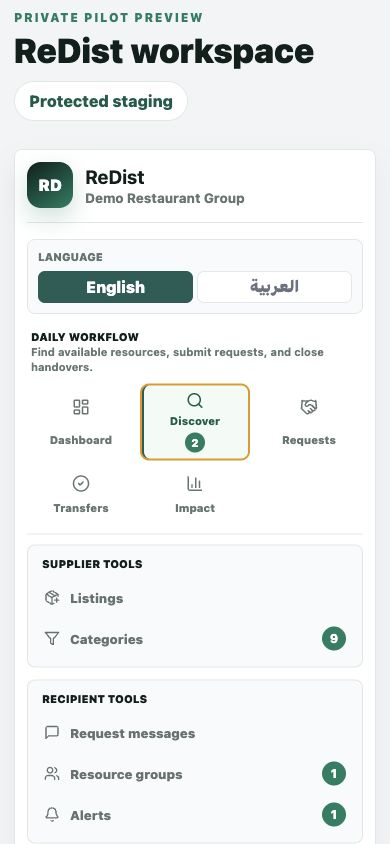
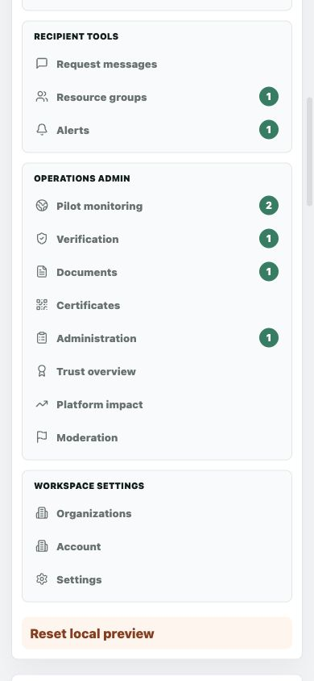
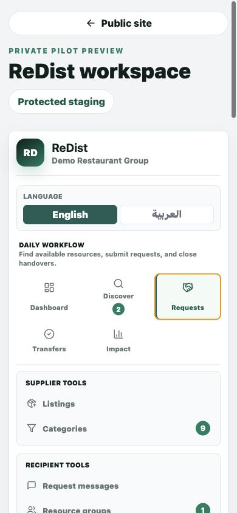
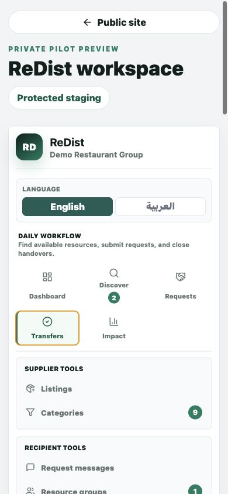
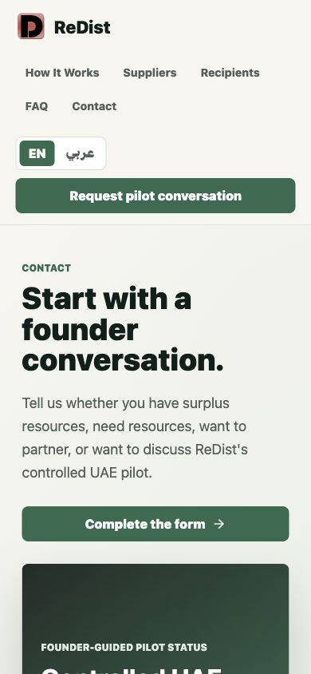

# ReDist Recipient Guide

Version: 2026-06-22  
Audience: Recipient organizations requesting resources  
Status: Bilingual guide for founder-guided pilot and early customer onboarding

## 1. Recipient Purpose

### English

Recipients use ReDist to discover available surplus, request suitable resources, track supplier response, complete handover, and access evidence after completion.

### العربية

يستخدم المستفيدون ReDist لاكتشاف الفائض المتاح، وطلب الموارد المناسبة، ومتابعة رد المورد، وإكمال التسليم، والوصول إلى الإثبات بعد الإكمال.

## 2. Start From Discover

### English

1. Open **Discover**.
2. Review available resource count, urgent resources, nearby resources, and categories.
3. Filter by category, location, urgency, pickup readiness, and organization type.
4. Compare resource name, quantity, condition, supplier, city, expiry, and request readiness.
5. Select the resource that best matches your need.

### العربية

1. افتح **الاكتشاف**.
2. راجع عدد الموارد المتاحة والموارد العاجلة والموارد القريبة والفئات.
3. استخدم الفلاتر حسب الفئة والموقع والأولوية وجاهزية الاستلام ونوع المؤسسة.
4. قارن اسم المورد والكمية والحالة والمورد والمدينة والانتهاء وجاهزية الطلب.
5. اختر المورد الأكثر ملاءمة لاحتياجك.

## 3. Submit A Request

### English

1. Review the resource detail panel.
2. Confirm quantity, city, urgency, condition, supplier, and handover notes.
3. Enter the quantity your organization needs.
4. Write a practical request message.
5. Explain pickup readiness, intended use, and timing.
6. Submit only when your organization can complete the handover.

### العربية

1. راجع لوحة تفاصيل المورد.
2. أكد الكمية والمدينة والأولوية والحالة والمورد وملاحظات التسليم.
3. أدخل الكمية التي تحتاجها مؤسستك.
4. اكتب رسالة طلب عملية.
5. اشرح جاهزية الاستلام والاستخدام المقصود والتوقيت.
6. أرسل الطلب فقط عندما تستطيع مؤسستك إكمال التسليم.

## 4. Track Request Status

### English

1. Open **Requests**.
2. Check **Awaiting Other Party** for submitted requests pending supplier response.
3. Check **Active Transfers** once a request is accepted.
4. Review current status, supplier organization, resource, quantity, city, and next required action.
5. Watch for scheduling or verification steps before completion.

### العربية

1. افتح **الطلبات**.
2. راجع **بانتظار الطرف الآخر** للطلبات المرسلة بانتظار رد المورد.
3. راجع **التحويلات النشطة** بعد قبول الطلب.
4. راجع الحالة الحالية ومؤسسة المورد والمورد والكمية والمدينة والإجراء التالي المطلوب.
5. تابع خطوات الجدولة أو التحقق قبل الإكمال.

## 5. Complete Transfer And Access Evidence

### English

1. Open **Transfers**.
2. Review accepted handovers under **Ready for Handover**.
3. Coordinate pickup or delivery with the supplier.
4. Complete verification when the transfer has actually happened.
5. Open **Certificates** after completion to review available evidence.
6. Review **Impact** for organization contribution after completed workflows.

### العربية

1. افتح **التحويلات**.
2. راجع التسليمات المقبولة ضمن **جاهز للتسليم**.
3. نسق الاستلام أو التوصيل مع المورد.
4. أكمل التحقق عندما يحدث التحويل فعليا.
5. افتح **الشهادات** بعد الإكمال لمراجعة الإثبات المتاح.
6. راجع **الأثر** لمعرفة مساهمة المؤسسة بعد اكتمال المسارات.

## 6. Support

### English

1. Use the Contact page for access, support, or pilot questions.
2. Do not submit sensitive documents through the public form.
3. Contact the founder if resource suitability, safety, or handover responsibility is unclear.

### العربية

1. استخدم صفحة التواصل لطلب الوصول أو الدعم أو أسئلة التجربة.
2. لا ترسل مستندات حساسة عبر النموذج العام.
3. تواصل مع المؤسس إذا كانت ملاءمة المورد أو السلامة أو مسؤولية التسليم غير واضحة.
