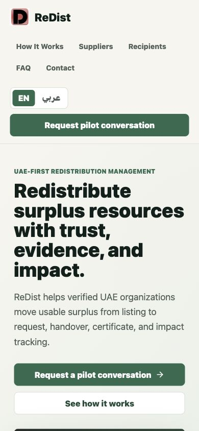

# ReDist User Manual

Version: 2026-06-22  
Audience: Suppliers, recipients, administrators, pilot participants, and future customers  
Status: Bilingual end-user guide for founder-guided pilot and early customer onboarding

## Screenshot Set

| Page | Screenshot |
| --- | --- |
| Public website | `docs/assets/user-manual/public-home.png` |
| Contact and support | `docs/assets/user-manual/public-contact.png` |
| Dashboard | `docs/assets/user-manual/workspace-dashboard.png` |
| Discover resources | `docs/assets/user-manual/workspace-discover.png` |
| Submit request | `docs/assets/user-manual/workspace-submit-request.png` |
| Requests queue | `docs/assets/user-manual/workspace-requests.png` |
| Transfers | `docs/assets/user-manual/workspace-transfers.png` |
| Certificates | `docs/assets/user-manual/workspace-certificates.png` |
| Impact | `docs/assets/user-manual/workspace-impact.png` |

## Section 1: Introduction

### English

ReDist is a UAE-first redistribution management platform for verified organizations. It helps organizations move usable surplus through a controlled workflow: list resources, discover available surplus, submit requests, approve requests, coordinate handovers, verify completion, issue certificates, and review impact.

ReDist is used by:

1. Suppliers with surplus resources.
2. Recipients that need resources.
3. Administrators who manage verification, trust, documents, and pilot operations.
4. Founder-guided pilot participants who are validating the workflow before wider launch.

### العربية

ReDist منصة إماراتية لإدارة إعادة التوزيع بين المؤسسات الموثقة. تساعد المنصة المؤسسات على نقل الفائض القابل للاستخدام عبر مسار منظم: نشر الموارد، اكتشاف الفائض المتاح، إرسال الطلبات، اعتماد الطلبات، تنسيق التسليم، التحقق من الإكمال، إصدار الشهادات، ومراجعة الأثر.

يستخدم ReDist:

1. الموردون الذين لديهم موارد فائضة.
2. المستفيدون الذين يحتاجون إلى موارد.
3. المشرفون الذين يديرون التحقق والثقة والمستندات وعمليات التجربة.
4. المشاركون في التجربة الموجهة من المؤسس قبل الإطلاق الأوسع.

## Section 2: Getting Started

### English

1. Open `https://www.redistribut.com`.
2. Review the public website to understand the workflow and pilot status.
3. Use the language switcher if Arabic is preferred.
4. Select **Contact** or **Request pilot conversation** to ask for access.
5. After approval, open the workspace link provided by the founder or administrator.
6. Log in using the account details assigned to your organization.
7. Confirm your organization profile, role, city, and account type before starting a workflow.

### العربية

1. افتح `https://www.redistribut.com`.
2. راجع الموقع العام لفهم مسار العمل وحالة التجربة.
3. استخدم زر اللغة إذا كنت تفضل العربية.
4. اختر **تواصل معنا** أو **اطلب محادثة تجريبية** لطلب الوصول.
5. بعد الموافقة، افتح رابط مساحة العمل الذي يرسله المؤسس أو المشرف.
6. سجل الدخول باستخدام بيانات الحساب المخصصة لمؤسستك.
7. تأكد من ملف المؤسسة والدور والمدينة ونوع الحساب قبل بدء أي مسار.

## Section 3: Dashboard

### Page Purpose: English

The Dashboard is the daily action center. It answers: what should move today?

Main actions:

1. Create a listing if you are a supplier.
2. Discover resources if you are a recipient.
3. Review requests if another organization has requested your surplus.
4. View transfers if a handover is ready or completed.
5. Check Needs Attention before reviewing impact metrics.

### الغرض من الصفحة: العربية

لوحة التحكم هي مركز العمل اليومي. تجيب على سؤال: ما الذي يجب تحريكه اليوم؟

الإجراءات الرئيسية:

1. أنشئ عرضا إذا كنت موردا.
2. اكتشف الموارد إذا كنت مستفيدا.
3. راجع الطلبات إذا طلبت مؤسسة أخرى فائضك.
4. افتح التحويلات إذا كان هناك تسليم جاهز أو مكتمل.
5. راجع قسم ما يحتاج إلى انتباه قبل النظر إلى مؤشرات الأثر.

## Section 4: Discover Resources

### English

1. Open **Discover** from the daily workflow navigation.
2. Review the discovery summary: available resources, urgent resources, nearby resources, and categories.
3. Use operational filters for category, location, availability, urgency, pickup readiness, organization type, and offer type.
4. Scan the resource list for name, quantity, supplier, location, expiry or urgency, and request status.
5. Select a resource to review practical handover information before submitting a request.

### العربية

1. افتح **الاكتشاف** من تنقل سير العمل اليومي.
2. راجع ملخص الاكتشاف: الموارد المتاحة، الموارد العاجلة، الموارد القريبة، والفئات.
3. استخدم الفلاتر التشغيلية للفئة والموقع وحالة التوفر والأولوية وجاهزية الاستلام ونوع المؤسسة ونوع العرض.
4. راجع قائمة الموارد حسب الاسم والكمية والمورد والموقع والانتهاء أو الأولوية وحالة الطلب.
5. اختر موردا لمراجعة معلومات التسليم العملية قبل إرسال الطلب.

## Section 5: Submit Request

### English

1. Open **Discover**.
2. Select the resource that matches your organization need.
3. Review supplier, quantity, city, urgency, condition, and handover methods.
4. Enter the quantity required.
5. Add a clear request message explaining why the resource is needed and how pickup or handover can happen.
6. Submit only if the resource is suitable and your organization can complete the handover.

### العربية

1. افتح **الاكتشاف**.
2. اختر المورد المناسب لاحتياج مؤسستك.
3. راجع المورد والكمية والمدينة والأولوية والحالة وطرق التسليم.
4. أدخل الكمية المطلوبة.
5. أضف رسالة طلب واضحة تشرح سبب الحاجة إلى المورد وكيف يمكن الاستلام أو التسليم.
6. أرسل الطلب فقط إذا كان المورد مناسبا وكانت مؤسستك قادرة على إكمال التسليم.

## Section 6: Requests Queue

### English

1. Open **Requests**.
2. Start with **Awaiting My Action** to identify requests that need approval, scheduling, or verification.
3. Review **Awaiting Other Party** to understand what is pending with a supplier, recipient, or verifier.
4. Use **Active Transfers** to track accepted requests moving toward handover.
5. Review **Completed / Closed** for completed, rejected, or cancelled requests.
6. Keep actions focused on the next required workflow step.

### العربية

1. افتح **الطلبات**.
2. ابدأ بقسم **بانتظار إجراء مني** لمعرفة الطلبات التي تحتاج إلى موافقة أو جدولة أو تحقق.
3. راجع **بانتظار الطرف الآخر** لفهم ما ينتظر المورد أو المستفيد أو المراجع.
4. استخدم **التحويلات النشطة** لمتابعة الطلبات المقبولة المتجهة إلى التسليم.
5. راجع **مكتملة / مغلقة** للطلبات المكتملة أو المرفوضة أو الملغاة.
6. ركز كل إجراء على الخطوة التالية المطلوبة في مسار العمل.

## Section 7: Transfers

### English

1. Open **Transfers**.
2. Review **Ready for Handover** for accepted requests prepared for pickup or delivery.
3. Review **Verification Required** for handovers that need completion confirmation.
4. Check who must verify the transfer and what action is required.
5. Use **Completed Transfers** for finished handovers and certificate availability.
6. Review **Exceptions / Delays** for cancelled, expired, declined, or blocked handovers.

### العربية

1. افتح **التحويلات**.
2. راجع **جاهز للتسليم** للطلبات المقبولة الجاهزة للاستلام أو التوصيل.
3. راجع **التحقق مطلوب** للتسليمات التي تحتاج إلى تأكيد الإكمال.
4. تحقق ممن يجب عليه تأكيد التحويل وما الإجراء المطلوب.
5. استخدم **التحويلات المكتملة** للتسليمات المنتهية وتوفر الشهادات.
6. راجع **الاستثناءات / التأخيرات** للتحويلات الملغاة أو المنتهية أو المرفوضة أو المتوقفة.

## Section 8: Certificates

### English

1. Open **Certificates** from the operations admin area.
2. Review issued or pending transfer certificates.
3. Use certificate references only as operational evidence of completed ReDist workflows.
4. Do not treat certificates as tax invoices, legal title documents, government approvals, or audited ESG certificates.
5. Use certificate evidence together with transfer status, verification history, and impact records.

### العربية

1. افتح **الشهادات** من منطقة إدارة العمليات.
2. راجع شهادات التحويل الصادرة أو المعلقة.
3. استخدم مراجع الشهادات كإثبات تشغيلي فقط لمسارات ReDist المكتملة.
4. لا تعتبر الشهادات فواتير ضريبية أو مستندات ملكية قانونية أو موافقات حكومية أو شهادات ESG مدققة.
5. استخدم إثبات الشهادة مع حالة التحويل وسجل التحقق وسجلات الأثر.

## Section 9: Impact

### English

1. Open **Impact**.
2. Review the impact summary: AED value recovered, items redistributed, waste diverted, and certificate evidence where available.
3. Check transfer outcomes to understand completed transfers and certificates generated.
4. Review organization contribution to see supplier and recipient activity.
5. Treat impact figures as platform-supported evidence or estimates unless independently audited.

### العربية

1. افتح **الأثر**.
2. راجع ملخص الأثر: القيمة المستردة بالدرهم، العناصر المعاد توزيعها، النفايات التي تم تجنبها، وإثبات الشهادات عند توفره.
3. راجع نتائج التحويل لفهم التحويلات المكتملة والشهادات الصادرة.
4. راجع مساهمة المؤسسة لمعرفة نشاط الموردين والمستفيدين.
5. تعامل مع أرقام الأثر كإثباتات أو تقديرات مدعومة من المنصة ما لم يتم تدقيقها بشكل مستقل.

## Section 10: Contact and Support

### English

1. Open **Contact** on the public website.
2. Select the inquiry type: pilot interest, supplier inquiry, recipient inquiry, partnership request, ESG discussion, founder walkthrough, or general question.
3. Provide name, organization, work email, phone, role, city or emirate, timeline, and message.
4. Do not submit sensitive documents through the contact form.
5. Wait for founder review before receiving pilot workspace access.

### العربية

1. افتح **تواصل معنا** في الموقع العام.
2. اختر نوع الاستفسار: اهتمام بالتجربة، استفسار مورد، استفسار مستفيد، طلب شراكة، نقاش ESG، جولة مع المؤسس، أو سؤال عام.
3. أدخل الاسم والمؤسسة والبريد الإلكتروني للعمل والهاتف والدور والمدينة أو الإمارة والإطار الزمني والرسالة.
4. لا ترسل مستندات حساسة عبر نموذج التواصل.
5. انتظر مراجعة المؤسس قبل الحصول على وصول لمساحة العمل التجريبية.
