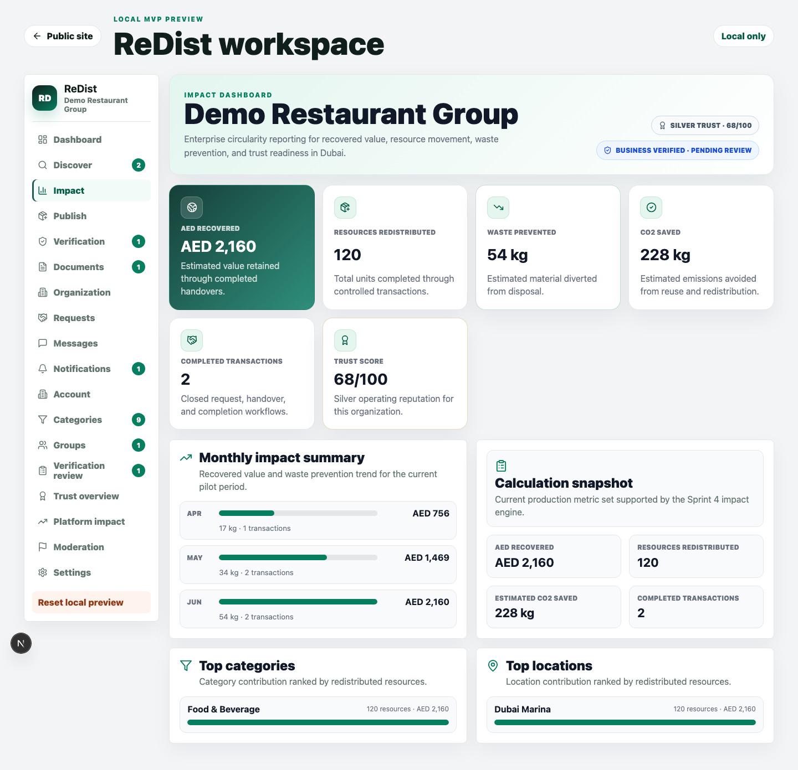
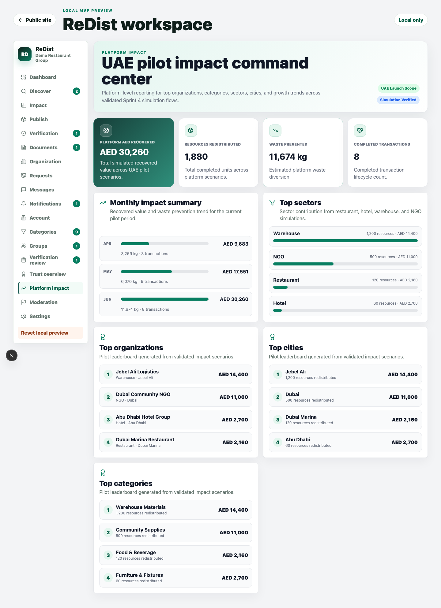
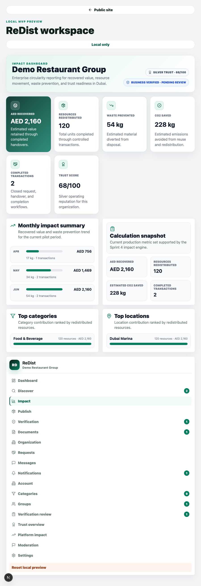
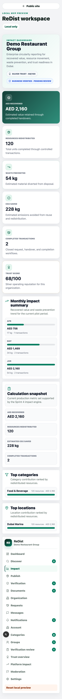

# Sprint 4 Impact Dashboard Report

Date: 2026-06-20

## Scope

Sprint 4 delivered the first production foundation for the ReDist Impact Dashboard. The implementation focused only on impact calculation, impact persistence contracts, aggregation APIs, reusable dashboard components, organization reporting, admin platform reporting, leaderboards, and simulation validation.

`IMPACT_DASHBOARD_DESIGN.md` was requested as an input, but it is not present in the repository. This sprint used the available approved sources instead:

- `REDIST_DESIGN_SYSTEM.md`
- `PRODUCTION_ARCHITECTURE.md`
- `METRONIC_UI_TRANSFORMATION_PLAN.md`
- `SIMULATION_SCENARIOS.md`
- Existing Dashboard, Verification, and Trust Score implementation patterns

No Transfer Certificate work was started. No Arabic phase work was started. No native mobile app work was started.

## Implemented Backend Foundation

### Shared Contracts

Updated `packages/shared/src/index.ts` with:

- `impactScopes`: `user`, `organization`, `platform`
- `impactMetricSnapshotSchema`
- `impactHistorySearchSchema`
- `impactBreakdownItemSchema`
- Impact TypeScript types for API and service use

### Database

Added migration:

- `supabase/migrations/202606200002_impact_dashboard_engine.sql`

Created:

- `impact_scope` enum
- `impact_metric_history` table
- `record_impact_metric_snapshot(...)` RPC
- RLS policies for user, organization, and platform visibility
- Audit mirror event: `impact.snapshot.recorded`

The history model supports user-level, organization-level, and platform-level snapshots with period boundaries, country scoping, category/location breakdowns, and calculation metadata.

### Impact Calculation Service

Added:

- `apps/web/src/lib/impact.ts`

Implemented:

- `calculateImpactMetrics(...)`
- `listImpactHistory(...)`
- `recordImpactSnapshot(...)`

Tracked metrics:

- AED recovered
- Resources redistributed
- Waste prevented
- Estimated CO2 saved
- Completed transactions
- Active listings
- Active requests
- Top categories
- Top locations

Starter calculation factors are isolated by unit type so future UAE-specific coefficients can replace the MVP assumptions without changing API consumers.

### APIs

Added:

- `GET /api/v1/impact`
- `POST /api/v1/impact/calculate`
- `GET /api/v1/organizations/{id}/impact`

Updated:

- `docs/API.md`

`POST /api/v1/impact/calculate` can calculate metrics from listing/request payloads without persistence, or persist a snapshot when `persist` is `true`.

## Implemented UI

Updated:

- `apps/web/src/app/app/workspace.tsx`
- `apps/web/src/app/globals.css`

Added workspace navigation:

- `Impact`
- `Platform impact`

### Reusable Components

Created:

- Impact KPI Card
- Impact Trend Card
- Category Breakdown Card
- Location Breakdown Card
- Monthly Impact Summary
- Impact Leaderboard

### Organization Impact Dashboard

Displays:

- AED recovered
- Resources redistributed
- Waste prevented
- Estimated CO2 saved
- Completed transactions
- Trust score
- Verification level/status
- Monthly trends
- Top categories
- Top locations

### Admin Platform Dashboard

Displays:

- Platform AED recovered
- Platform resources redistributed
- Platform waste prevented
- Platform completed transactions
- Top sectors
- Top organizations
- Top cities
- Top categories
- Growth trends

The admin dashboard uses the validated Restaurant, Hotel, Warehouse, and NGO simulation scenarios as the seeded platform impact model.

## Simulation Validation

Validated scenarios:

| Scenario | Completed Quantity | Completed Requests | Result |
| --- | ---: | ---: | --- |
| Restaurant | 120 | 2 | Pass |
| Hotel | 60 | 2 | Pass |
| Warehouse | 1,200 | 2 | Pass |
| NGO | 500 | 2 | Pass |

Combined platform impact from simulations:

| Metric | Value |
| --- | ---: |
| AED recovered | AED 30,260 |
| Resources redistributed | 1,880 |
| Waste prevented | 11,674 kg |
| Estimated CO2 saved | 16,908 kg |
| Completed transactions | 8 |

Top category:

- Warehouse materials: 1,200 resources redistributed

Top location:

- Jebel Ali: 1,200 resources redistributed

## Screenshots

Organization Impact Dashboard:

Admin Platform Impact Dashboard:

Tablet validation:

Mobile validation:

## Validation Results

| Command | Result |
| --- | --- |
| `./.tools/pnpm typecheck` | Pass |
| `./.tools/pnpm build` | Pass |
| `./.tools/pnpm test` | Pass, 18 tests |
| `node scripts/simulation-runner.mjs` | Pass, 4/4 scenarios |

Build output confirmed the new API routes:

- `/api/v1/impact`
- `/api/v1/impact/calculate`
- `/api/v1/organizations/[id]/impact`

## Files Changed

- `packages/shared/src/index.ts`
- `supabase/migrations/202606200002_impact_dashboard_engine.sql`
- `apps/web/src/lib/impact.ts`
- `apps/web/src/app/api/v1/impact/route.ts`
- `apps/web/src/app/api/v1/impact/calculate/route.ts`
- `apps/web/src/app/api/v1/organizations/[id]/impact/route.ts`
- `apps/web/src/app/app/workspace.tsx`
- `apps/web/src/app/globals.css`
- `scripts/sprint4-impact-dashboard.test.mjs`
- `docs/API.md`
- `docs/SPRINT4_IMPACT_DASHBOARD_REPORT.md`
- `docs/screenshots/sprint4-organization-impact-dashboard.png`
- `docs/screenshots/sprint4-admin-impact-dashboard.png`
- `docs/screenshots/sprint4-impact-tablet.png`
- `docs/screenshots/sprint4-impact-mobile.png`

## Notes

- The impact engine currently uses starter coefficients for value, waste, and CO2 by unit type.
- These coefficients are intentionally centralized in the calculation service for later replacement by UAE-specific methodology.
- The UI is desktop/tablet/mobile responsive inside the existing web workspace, but no native mobile work was started.
