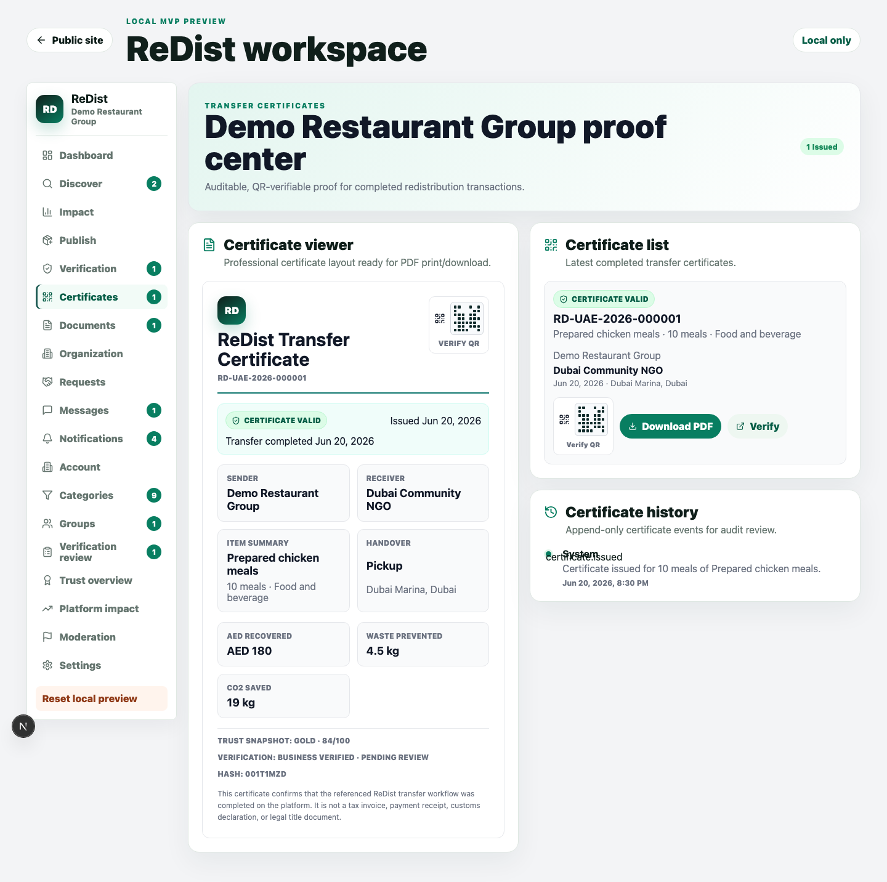
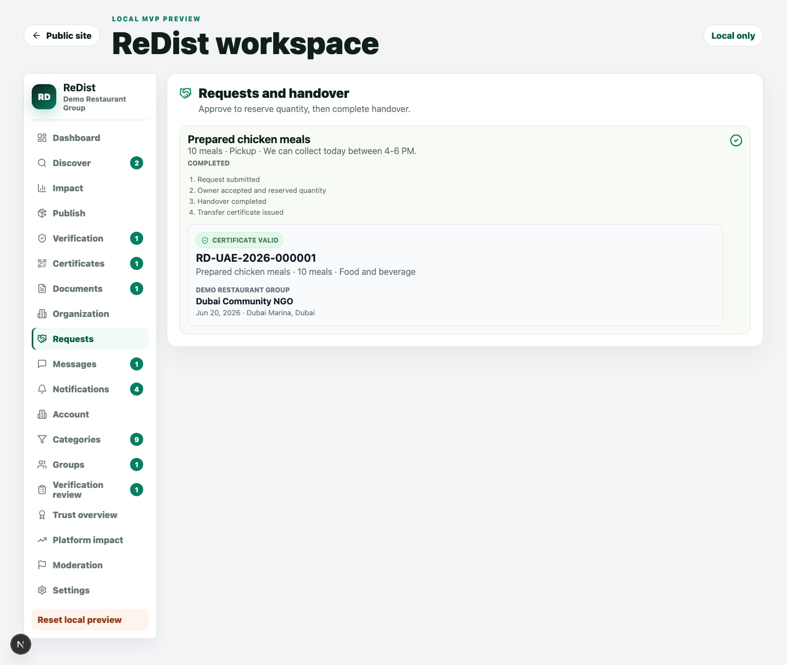
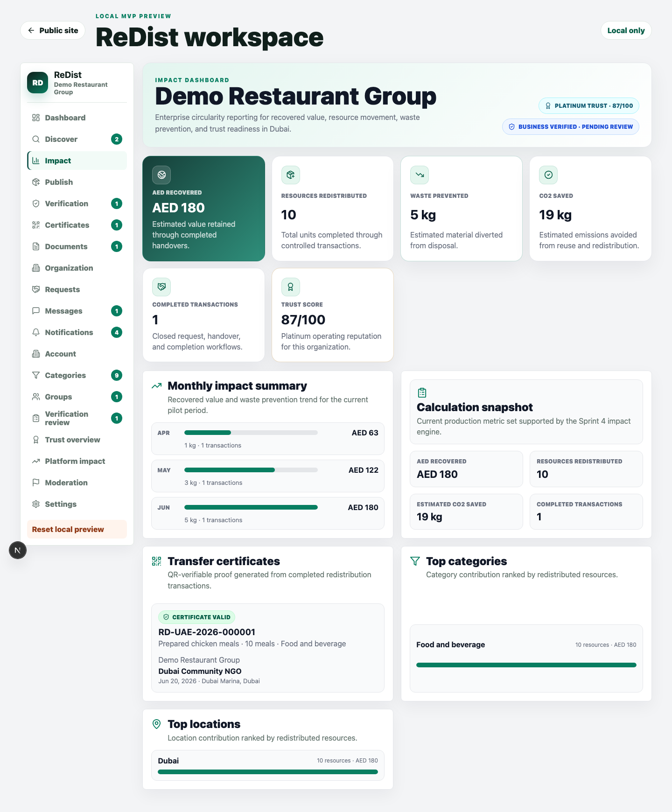
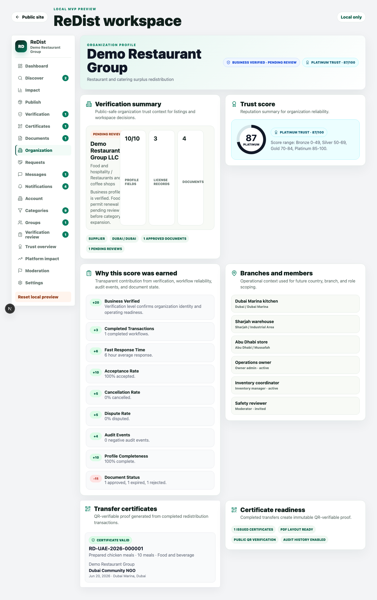
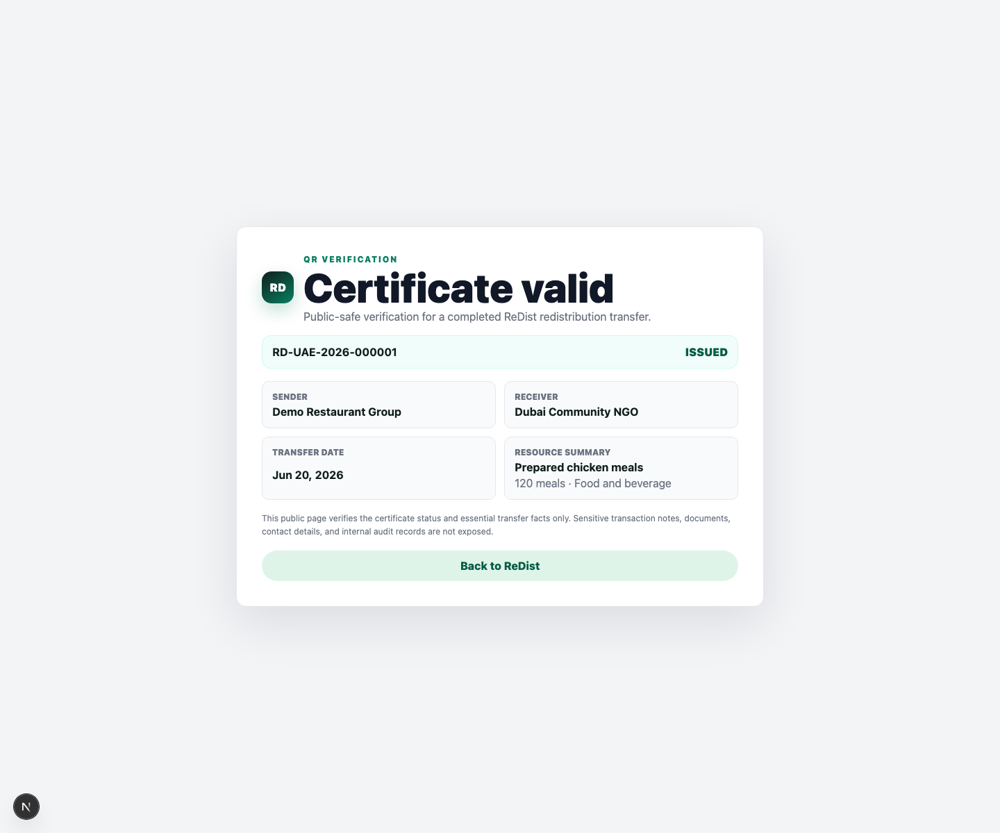

# Sprint 5 Transfer Certificate Report

Date: 2026-06-20

## Scope

Sprint 5 delivered the first production foundation for Transfer Certificates and QR verification. The implementation creates auditable proof for completed redistribution transactions while keeping public verification data minimal and tenant-safe.

Inputs used:

- `TRANSFER_CERTIFICATE_DESIGN.md`
- `REDIST_DESIGN_SYSTEM.md`
- `PRODUCTION_ARCHITECTURE.md`
- Existing Sprint 4 Impact Dashboard foundation
- Existing simulation runner scenarios

No Arabic work was started. No native mobile work was started. The sprint focused only on Transfer Certificate and QR verification.

## Backend Implementation

### Shared Contracts

Updated `packages/shared/src/index.ts` with:

- Transfer certificate statuses: `issued`, `revoked`, `superseded`, `expired`
- Trust snapshot schema
- Impact snapshot schema
- Transfer certificate creation schema
- Transfer certificate search schema
- TypeScript contract exports

### Database Foundation

Added migration:

- `supabase/migrations/202606200003_transfer_certificate_foundation.sql`

Created:

- `transfer_certificate_status` enum
- `transfer_certificates`
- `transfer_certificate_history`
- Certificate number sequence
- Certificate payload hash function
- Certificate history trigger
- `issue_transfer_certificate(...)` RPC
- `verify_transfer_certificate(...)` RPC
- Participant/admin RLS policies
- Audit mirroring into `audit_events`

Audit events covered:

- `certificate.issued`
- `certificate.revoked`
- `certificate.superseded`

### Certificate Service

Added:

- `apps/web/src/lib/transfer-certificate.ts`

Implemented:

- Local certificate generation for the MVP workspace
- Certificate number generation
- QR verification token generation
- Certificate hash generation
- Dependency-free PDF payload generation
- Public verification URL helper
- Public-safe demo verification payload
- Supabase wrappers for listing, issuing, and verifying certificates

### APIs

Added:

- `GET /api/v1/certificates`
- `POST /api/v1/certificates`
- `GET /api/v1/certificates/{id}/history`
- `GET /api/v1/certificates/{id}/download`
- `GET /api/v1/public/certificates/{token}`

Updated:

- `docs/API.md`

## Certificate Lifecycle

The workspace now generates a certificate automatically when a request handover is marked complete.

Lifecycle implemented:

1. Request submitted.
2. Owner approves request and reserves quantity.
3. Owner completes handover.
4. Certificate is issued automatically.
5. Certificate history receives `certificate.issued`.
6. Workspace audit receives `certificate.issued`.
7. Certificate becomes visible in transaction detail, certificates workspace, organization profile, and impact dashboard.
8. QR verification URL becomes available.

Rules implemented or represented:

- Certificate is immutable after local issue.
- Version/history model is represented by `transfer_certificate_history`.
- Multi-tenant database policies restrict certificate visibility to participant organizations and platform roles.
- Public verification exposes only safe fields.

## PDF Certificate Layout

Implemented a professional print-ready certificate layout in the workspace and a server-side PDF payload generator for the certificate download endpoint.

Includes:

- ReDist branding
- Certificate number
- QR verification block
- Sender
- Receiver
- Item summary
- Handover method/location
- Impact summary
- Trust snapshot
- Verification summary
- Certificate hash
- Disclaimer

The download endpoint returns an `application/pdf` response containing ReDist branding, certificate metadata, QR token block, impact summary, trust summary, and verification URL. The database model also keeps `pdf_storage_path` for a future stored-render workflow.

## QR Verification

Added public verification page:

- `/verify/certificates/{token}`

Public page shows:

- Certificate valid or invalid state
- Certificate ID
- Sender
- Receiver
- Transfer date
- Resource summary

Public page does not expose:

- Contact details
- Uploaded verification documents
- Internal notes
- Storage paths
- Internal audit records
- Sensitive transaction metadata

## UI Implementation

Updated:

- `apps/web/src/app/app/workspace.tsx`
- `apps/web/src/app/globals.css`

Added:

- Certificates workspace navigation item
- Certificate Viewer
- Certificate Download / print action
- Certificate History
- QR Verification block
- Public QR verification page
- Certificate card in completed request detail
- Certificate panel in Organization Profile
- Certificate panel in Impact Dashboard

## Scenario Validation

Validated using the required simulation scenarios:

| Scenario | Completed Quantity | Completed Requests | Certificate Result |
| --- | ---: | ---: | --- |
| Restaurant | 120 | 2 | Pass |
| Hotel | 60 | 2 | Pass |
| Warehouse | 1,200 | 2 | Pass |
| NGO | 500 | 2 | Pass |

Automated tests confirm that completed simulation scenarios can produce issued, QR-verifiable certificates.

## Screenshots

Certificate Viewer:

Transaction Detail Certificate:

Impact Dashboard Certificate Integration:

Organization Profile Certificate Integration:

Public QR Verification:

## Validation Results

| Command | Result |
| --- | --- |
| `./.tools/pnpm typecheck` | Pass |
| `./.tools/pnpm build` | Pass |
| `./.tools/pnpm test` | Pass, 25 tests |
| `node scripts/simulation-runner.mjs` | Pass, 4/4 scenarios |

Build output confirmed:

- `/api/v1/certificates`
- `/api/v1/certificates/[id]/download`
- `/api/v1/certificates/[id]/history`
- `/api/v1/public/certificates/[token]`
- `/verify/certificates/[token]`

## Files Changed

- `packages/shared/src/index.ts`
- `supabase/migrations/202606200003_transfer_certificate_foundation.sql`
- `apps/web/src/lib/transfer-certificate.ts`
- `apps/web/src/app/api/v1/certificates/route.ts`
- `apps/web/src/app/api/v1/certificates/[id]/download/route.ts`
- `apps/web/src/app/api/v1/certificates/[id]/history/route.ts`
- `apps/web/src/app/api/v1/public/certificates/[token]/route.ts`
- `apps/web/src/app/verify/certificates/[token]/page.tsx`
- `apps/web/src/app/app/workspace.tsx`
- `apps/web/src/app/globals.css`
- `scripts/sprint5-transfer-certificate.test.mjs`
- `docs/API.md`
- `docs/SPRINT5_TRANSFER_CERTIFICATE_REPORT.md`
- `docs/screenshots/sprint5-certificate-viewer.png`
- `docs/screenshots/sprint5-transaction-detail-certificate.png`
- `docs/screenshots/sprint5-impact-dashboard-certificate.png`
- `docs/screenshots/sprint5-organization-profile-certificate.png`
- `docs/screenshots/sprint5-public-qr-verification.png`

## Notes

- The current PDF capability includes a generated PDF response plus the professional browser print-ready layout.
- The database remains ready for future stored PDFs through `pdf_storage_path`.
- QR rendering is dependency-free for this sprint and uses a deterministic visual verification block.
- First-class transaction and handover tables are still recommended before certificates become customer-facing in production.
