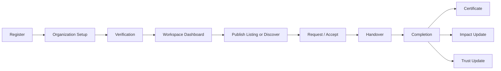
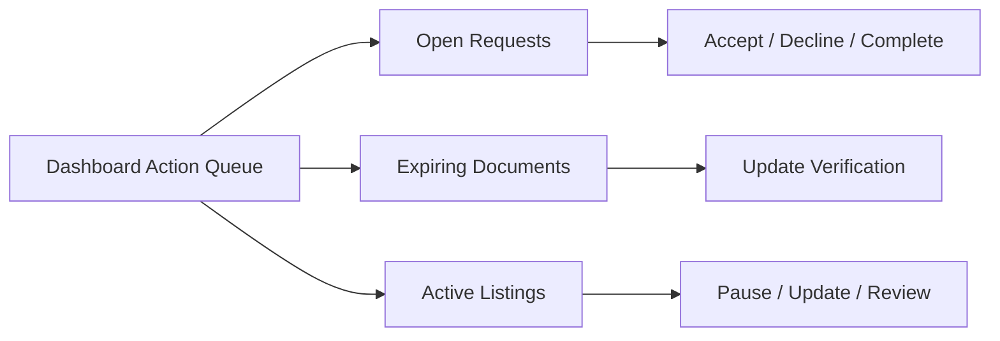
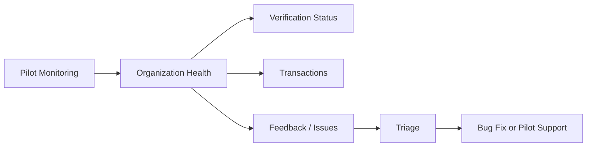

# ReDist UI And Workflow Revalidation Report

Date: 2026-06-21  
Purpose: Revalidate the current ReDist page layout and workflow arrangement against the approved design system, Metronic mapping, and pilot-stage product goals.

## Executive Summary

The current ReDist platform is technically much stronger than its page experience. The backend, validation, security, trust, impact, certificate, RTL, and pilot capabilities have advanced toward controlled pilot readiness, but the workspace still feels like a dense MVP control panel rather than a polished enterprise SaaS product.

The main issue is not color, typography, or individual cards. The issue is information architecture and workflow sequencing.

Current UI pattern:

- Many major modules live inside one `/app` workspace.
- Navigation switches local sections instead of giving each workflow a clear route.
- Several different user goals compete on the same screen.
- Operational workflows are present, but their order is not always obvious.
- Founder, admin, reviewer, and organization user experiences are not visually separated enough.

Corrected direction:

- Move from a single dense workspace to a route-based enterprise application shell.
- Make each core workflow visible as a clear page or step sequence.
- Prioritize operational clarity over marketplace browsing.
- Keep the circular economy positioning, but present it as enterprise resource governance, not charity or consumer resale.

## Current Version Assessment

| Area | Current state | Assessment |
| --- | --- | --- |
| Public experience | Landing page exists, but supporting public pages are not first-class routes | Needs route expansion and clearer enterprise positioning |
| Workspace shell | Most modules are inside one large `/app` workspace | Functional, but not enterprise-grade enough |
| Dashboard | Contains strong data points, but competes with many unrelated panels | Needs sharper executive and action-queue hierarchy |
| Discover | Includes filters and listing cards | Still risks feeling like a marketplace unless reframed around resource recovery workflows |
| Publish Listing | Functional form exists | Needs wizard-style sequencing and clearer compliance/verification context |
| Requests | Functional request lifecycle exists | Needs operational queue, detail drawer, timeline, and role-specific views |
| Verification | UI exists, but should feel like a guided compliance workflow | Needs wizard, document checklist, reviewer states, and expiry visibility |
| Trust Score | Present in UI | Needs consistent placement and explanation without overwhelming every card |
| Impact Dashboard | Present in UI | Needs stronger separation between organization impact and platform/admin impact |
| Certificates | Implemented and visible | Needs tighter integration into completed transaction details |
| Pilot Monitoring | Exists as founder-focused page | Should sit in a founder/admin section, not feel like a normal organization workspace page |
| Mobile layout | Responsive work exists | Needs stronger mobile workflow ordering, especially Discover, Requests, Verification, and Certificate views |

## Why The Current Layout Feels Unsatisfactory

### 1. Too many modules are competing inside one workspace

The current workspace includes dashboard, discover, publish, categories, requests, messages, groups, notifications, moderation, verification, trust, impact, certificates, settings, and pilot concepts. Even when the components are visually acceptable, the user has to infer the product structure.

Enterprise SaaS users should not have to discover the product architecture from a dense menu. The workspace should guide them through their job.

### 2. The workflow spine is not prominent enough

The core ReDist workflow is:

1. Organization setup.
2. Verification.
3. Publish or discover resources.
4. Request.
5. Accept and reserve.
6. Handover.
7. Complete transaction.
8. Generate certificate.
9. Update trust and impact.

The current UI supports this, but the sequence is distributed across sections. The user should feel the next step immediately.

### 3. Discover can feel like a marketplace

Listing cards, filters, save buttons, and item browsing are necessary, but the page needs to avoid consumer marketplace patterns. The page should feel like an enterprise resource discovery console with trust, eligibility, verification, and handover context.

### 4. Verification should feel like compliance, not settings

Verification is a core trust control. It should not feel like a profile subsection. It should be a guided workflow with required documents, expiry, review history, reviewer notes, and clear category unlock implications.

### 5. Requests need operational queue behavior

Requests are currently understandable, but the expected enterprise pattern is a queue with statuses, priorities, owners, request detail, timeline, messages, and next action. This is where daily operational usage will happen.

### 6. Founder/admin pages need stronger separation

Founder monitoring, verification review, audit logs, moderation, and platform analytics should not share the same mental model as organization workspace pages. They need a protected admin shell with role-specific navigation.

### 7. Mobile should prioritize action order

Mobile should not simply stack desktop panels. For ReDist, mobile is likely used during listing creation, pickup coordination, handover, certificate viewing, and QR verification. Those tasks need short, action-first layouts.

## Corrected Information Architecture

### Public

| Route | Purpose |
| --- | --- |
| `/` | Enterprise UAE-first landing page |
| `/about` | Mission, operating model, and UAE launch story |
| `/impact` | Public impact methodology and pilot outcomes |
| `/pricing` | Pilot, verified organization, and enterprise plans |
| `/enterprise` | Multi-branch and enterprise governance value |
| `/contact` | Pilot inquiry, support, and enterprise contact |

### Authentication And Onboarding

| Route | Purpose |
| --- | --- |
| `/login` | Production login |
| `/register` | Account registration |
| `/onboarding/organization` | Organization setup wizard |
| `/onboarding/verification` | First verification submission workflow |

### Organization Workspace

| Route | Purpose |
| --- | --- |
| `/app/dashboard` | Action-focused overview |
| `/app/discover` | Resource discovery console |
| `/app/listings/new` | Publish listing wizard |
| `/app/listings/[id]` | Listing detail and request panel |
| `/app/requests` | Request and handover queue |
| `/app/requests/[id]` | Request detail, timeline, messages, certificate |
| `/app/messages` | Request-linked inbox |
| `/app/notifications` | Notification center |
| `/app/organization` | Organization profile, branches, members |
| `/app/verification` | Verification dashboard and documents |
| `/app/impact` | Organization impact dashboard |
| `/app/certificates` | Certificate list and history |
| `/app/settings` | Preferences, account, security, notifications |

### Administration

| Route | Purpose |
| --- | --- |
| `/admin/dashboard` | Founder/platform overview |
| `/admin/pilot-monitoring` | Controlled pilot monitoring |
| `/admin/verification-review` | Reviewer queue |
| `/admin/moderation` | Listing/report moderation |
| `/admin/categories` | Category governance |
| `/admin/audit-logs` | Audit review |
| `/admin/analytics` | Platform analytics |

## Page-By-Page Revalidation

### Dashboard

Current state:

- Strong KPI and workflow content exists.
- Too much competes for attention.
- Needs clearer separation between overview, pending actions, activity, and health.

Recommended layout:

- Top row: verification status, trust score, impact summary, open requests.
- Main column: action queue and recent activity.
- Side column: notifications, expiring documents, certificate readiness.
- Lower section: active listings, recent requests, impact trend.

Required correction:

- Reduce visual weight of secondary panels.
- Make "what needs my attention today" the first thing users see.
- Use compact KPI cards with one primary action per panel.

### Discover

Current state:

- Search and filters are present.
- Listing cards exist.
- Needs stronger enterprise resource discovery feel.

Recommended layout:

- Advanced search header.
- Desktop filter sidebar.
- Mobile filter drawer.
- Sort and saved search controls.
- Listing cards with verification, trust, expiry, quantity, handover method, and request CTA.

Required correction:

- Replace marketplace-like emphasis with operational eligibility and handover readiness.
- Make category, location, expiry, and verification filters more prominent.
- Add list/card density options later if pilot users request it.

### Publish Listing

Current state:

- Functional publishing form exists.
- It is too form-heavy for first-time users.

Recommended layout:

- Wizard: basics, quantity/value, category/compliance, location/handover, review.
- Restricted category warnings should appear before submission.
- Verification requirement should be visible before publish.

Required correction:

- Sequence the form by decision order.
- Use stepper/wizard pattern from Metronic mapping.
- Keep draft and publish actions clear.

### Listing Details

Current state:

- Detail behavior is embedded in Discover.
- No strong dedicated page mental model.

Recommended layout:

- Resource summary.
- Organization trust and verification panel.
- Quantity and handover panel.
- Request form.
- Status and audit-safe activity.

Required correction:

- Promote to route-level detail page.
- Make request eligibility and handover method obvious.

### Requests

Current state:

- Request lifecycle exists.
- Actions are present.
- Operational queue hierarchy is not strong enough.

Recommended layout:

- Tabs: Incoming, Outgoing, Accepted, Handover, Completed, Declined/Cancelled.
- Left/table list: request queue.
- Right/detail drawer or page: timeline, listing, participant, messages, certificate.

Required correction:

- Treat requests as the daily operations center.
- Make next action visible for every request.
- Separate owner and requester responsibilities.

### Verification

Current state:

- Dashboard, documents, badges, and audit timeline exist.
- Needs stronger compliance workflow structure.

Recommended layout:

- Current level and status at top.
- Required document checklist.
- Expiring/rejected document alerts.
- Submission/review timeline.
- Reviewer notes and next actions.

Required correction:

- Make verification its own guided workspace.
- Do not hide document management inside settings.

### Organization Profile

Current state:

- Organization details exist.
- Profile, verification, branches, members, certificates, and trust are visually distributed.

Recommended layout:

- Profile header with legal name, trade name, verification badge, trust badge.
- Tabs: Overview, Branches, Members, Verification, Certificates, Activity.

Required correction:

- Create a single source of truth for organization identity.
- Make public-safe profile preview distinct from admin-only details.

### Impact Dashboard

Current state:

- Impact calculations and cards exist.
- Needs clearer executive analytics layout.

Recommended layout:

- KPI strip: AED recovered, waste prevented, CO2 saved, completed transactions.
- Trends.
- Category breakdown.
- Location breakdown.
- Leaderboards.

Required correction:

- Keep impact claims conservative and labeled as estimates.
- Separate organization dashboard from platform/admin dashboard.

### Transfer Certificates

Current state:

- Certificate generation, download, history, and QR verification exist.
- Needs tighter workflow placement.

Recommended layout:

- Certificate attached to completed request/transaction.
- Certificate list for organization history.
- Public QR verification page stays minimal and safe.

Required correction:

- Make certificate the natural final step of completion.
- Avoid exposing internal operational data on public verification pages.

### Admin And Pilot Monitoring

Current state:

- Pilot monitoring exists.
- Verification review and admin workflows exist in partial form.

Recommended layout:

- Separate founder/admin shell.
- Founder dashboard: pilot health, blockers, open issues, KPI trend.
- Reviewer dashboard: pending verification queue.
- Audit dashboard: privileged action history.

Required correction:

- Do not mix founder/admin monitoring with normal organization workspace navigation.

## Corrected Workflow Arrangement

### First-Time Organization Flow

### Daily Organization Flow

### Founder Pilot Flow

## Priority Findings

| Priority | Finding | Reason |
| --- | --- | --- |
| Critical | Workspace architecture is too monolithic | It hides the actual enterprise product structure |
| Critical | Workflow sequence is not prominent enough | Pilot users may not know what to do next |
| High | Requests need stronger queue/detail/timeline structure | This is the operational center of the platform |
| High | Verification needs to become a guided compliance workflow | Trust depends on this feeling credible |
| High | Admin/founder pages need separate protected shell | Role confusion weakens enterprise confidence |
| High | Discover should be reframed away from marketplace behavior | ReDist positioning is enterprise redistribution, not resale browsing |
| Medium | Dashboard needs hierarchy simplification | Current surface is useful but too visually busy |
| Medium | Mobile should be action-first, not just stacked desktop | Field usage will depend on fast handover and QR flows |

## Recommendation

The next step should be a UI Correction Sprint, not another capability sprint.

Recommended scope:

1. Create route-based workspace shell.
2. Split organization workspace from founder/admin workspace.
3. Rebuild Dashboard hierarchy around action queue.
4. Rebuild Discover as enterprise resource discovery.
5. Rebuild Requests as operational queue and detail workflow.
6. Rebuild Verification as guided compliance workflow.

Do not start new feature modules until this structure feels right.

## Decision

Current product capability: strong enough for controlled pilot validation.  
Current page/workflow experience: not yet satisfying enough for confident pilot demos without guided explanation.  
Recommended decision: pause new features and run UI Correction Sprint 1 before external demo expansion.

